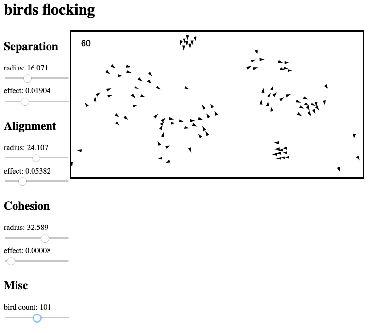

# birds

An implementation of [boids](https://en.wikipedia.org/wiki/Boids) flocking
simulation.

## notes

There's a bit of dead code left over in the source tree. It's not being used
because the algorithm had to be optimized (who knew running a functional
languge on top of js would slow things down...) but I think it's still
relevant.

One thing that I left out is predators. The simulation is currently pretty
boring, the birds reach an uninteresting, steady state pretty quickly.

https://www.red3d.com/cwr/boids/
